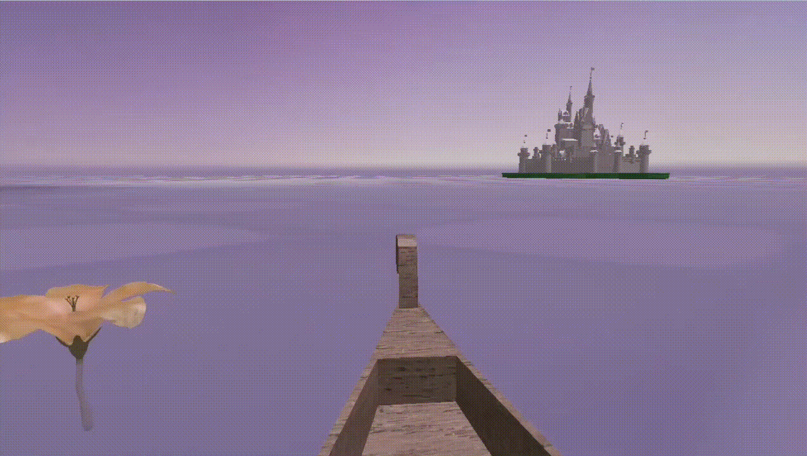

# Assignment 2 – Tangled-Inspired Floating Lanterns

## Camera Movements (Boat Control)
- Mouse: look around
- **W/S**: move the boat forward/back
- **A/D**: rotate the boat
- **P**: aerial perspective

<figure>
  
  <figcaption>aerial view by pressing key P</figcaption>
</figure>

## User Interaction (on the boat only)
- **Space**: spawn a lantern
- **C**: lanterns burst from the castle

## Textures Applied
- wooden texture on the boat
- lantern has a sun emblem
- glowing look on the flower

<table>
  <tr>
    <td>
      <figure>
        
        <figcaption>texture of the boat and flower</figcaption>
      </figure>
    </td>
    <td>
      <figure>
        
        <figcaption>lantern texture</figcaption>
      </figure>
    </td>
  </tr>
</table>

## Dynamic Lighting & Shadow
dynamic lighting applied to the lanterns (light source), and shadows are cast on the boat, island, and castle

shadow cast by lanterns spawned behind (as the boat moves forward)

dynamic lights and shadow on the castle as lanterns burst

## Hierarchical Rotation (2-level)
the flower (child) self-rotates and orbits around the boat (parent)
