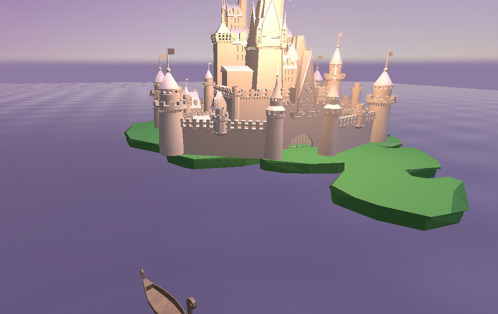
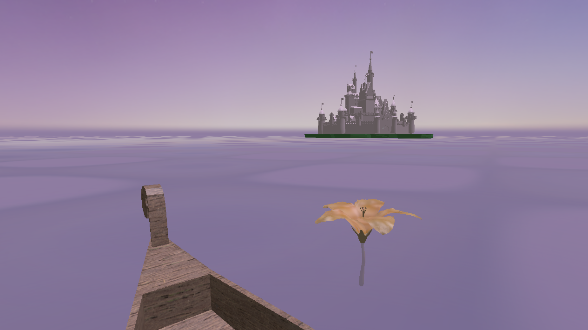
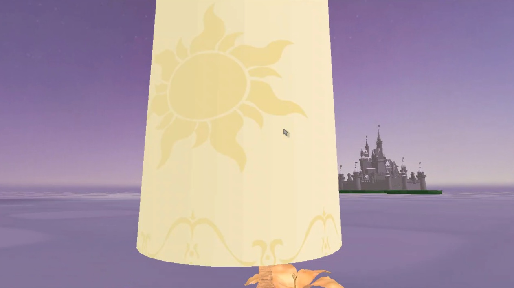
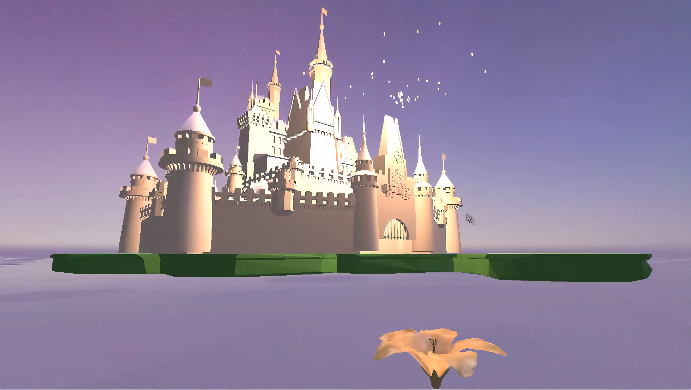

#Assignmment2 - Tangled-Inspired Floating Lanterns

##Camera Movements (Boat Control)
- Can use the mouse to look around.
- W/S: move the boat forward/back
- A/D: rotate the boat
- P: aerial perspective 
<figure>
  
  <figcaption>aerial view by pressing key P</figcaption>
</figure>

##User Interaction 
- via key control - possible on the boat only
- Space: spawn a lantern
- C: laterns burst from the castle

##Textures Applied
- wooden texture on the boat
- lantern has a sun emblem
- texture with glowing look on the flower

<table>
  <tr>
    <td>
      <figure>
        
        <figcaption>texture of the boat and flower</figcaption>
      </figure>
    </td>
    <td>
      <figure>
        <td></td>
        <figcaption>lantern texture</figcaption>
      </figure>
    </td>
  </tr>
</table>

##Dynamic Lighting & Shadow
dyncamic lighting applied to the lanterns (light source), and shadows are casted on the boat, island, and castle
<table>
  <tr>
    <td>
      <figure>
        
        <figcaption>shadow casted by the lanterns spawned in the back (as the boat moves forward)</figcaption>
      </figure>
    </td>
    <td>
      <figure>
        <td></td>
        <figcaption>dynamic lights and shadow casted on the castle as the lanterns burst</figcaption>
      </figure>
    </td>
  </tr>
</table>

##Hierarchical Rotation (2-level)
- the flower (child) self rotates and orbits around the boat (parent)
<video src="assets/pictures/flower_rotating.mp4" width="640" controls autoplay muted loop playsinline>
  Sorry, your browser doesn’t support embedded videos.
</video>